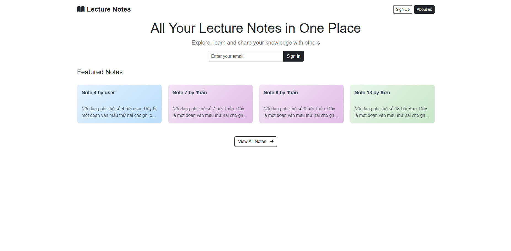

# LECTURE REVIEW

## 1. THÔNG TIN NHÓM

- Trịnh Nguyễn Hoàng Vũ - trinhnguyenhoangvu306@gmail.com
- Kiều Trương Hàm Hương - kthh135@gmail.com
- Trần Thị Huyền - tranthihuyen200412@gmail.com
- Phạm Thanh Thảo - thanhthao08112110@gmail.com

## 2. MÔ TẢ ĐỀ TÀI

### 2.1. Mô tả tổng quan
Hệ thống này là một ứng dụng web cho phép người dùng tạo, quản lý, chia sẻ ghi chú và có thể làm Quiz dể nhớ lại kiến thức. Ứng dụng nhằm giải quyết vấn đề quản lý kiến thức và tài liệu học tập một cách hiệu quả, đồng thời tạo môi trường để người dùng có thể chia sẻ kiến thức với nhau.

### 2.2. Mục tiêu
- Xây dựng hệ thống quản lý ghi chú với giao diện thân thiện, dễ sử dụng
- Hỗ trợ tạo và định dạng ghi chú với nội dung phong phú
- Cho phép người dùng chia sẻ ghi chú với người khác và tương tác qua bình luận
- Cung cấp hệ thống quản trị để kiểm soát nội dung và người dùng
- Đảm bảo bảo mật thông tin và dữ liệu người dùng
- Hỗ trợ tạo bài trắc nghiệm từ nội dung ghi chú để giúp người dùng ôn tập kiến thức

## 3. PHÂN TÍCH THIẾT KẾ

> **Lưu ý**: Để xem thông tin chi tiết hơn về các use case và đặc tả chức năng của hệ thống, vui lòng tham khảo [tài liệu đặc tả yêu cầu phần mềm (SRS.pdf)](./docs/SRS.pdf).

### 3.1. Phân tích yêu cầu
- Các yêu cầu chức năng:
  - Đăng ký, đăng nhập và quản lý tài khoản người dùng
  - Tạo, chỉnh sửa, xóa và khôi phục ghi chú
  - Chia sẻ ghi chú với người dùng khác
  - Thêm bình luận vào ghi chú được chia sẻ
  - Nhận thông báo khi có tương tác mới
  - Quản lý người dùng và nội dung (dành cho admin)
  - Tạo và làm bài trắc nghiệm từ nội dung ghi chú
- Các yêu cầu phi chức năng:
  - Bảo mật thông tin người dùng và dữ liệu
  - Giao diện người dùng thân thiện, dễ sử dụng
  - Hiệu suất nhanh và ổn định
  - Khả năng mở rộng hệ thống


### 3.2. Thiết kế hệ thống
#### Use case diagram

1. **Tổng quan hệ thống**
   

2. **Người dùng sử dụng phần mềm**
   

3. **Use case cho người dùng**
   

4. **Use case cho quản trị viên**
   

#### Thiết kế CSDL


Để xem sơ đồ cơ sở dữ liệu chi tiết và tương tác, truy cập [Sơ đồ CSDL trên dbdiagram.io](https://dbdiagram.io/d/682844f21227bdcb4eba6be4)

#### Thiết kế giao diện
1. **Màn hình đăng nhập**
   

2. **Màn hình đăng ký**
   

3. **Trang chủ (Home)**
   

4. **Bảng điều khiển người dùng**
   

5. **Tạo bản tóm tắt mới**
   

6. **Quản lý tất cả bản tóm tắt**
   

7. **Chia sẻ bản tóm tắt**
   

8. **Thùng rác**
   

9. **Bảng điều khiển quản trị viên**
   

10. **Quản lý người dùng (Admin)**
    

11. **Quản lý nội dung (Admin)**
    

Các màn hình được thiết kế theo phong cách phẳng (flat design), sử dụng bảng màu hài hòa, với các thành phần giao diện được bố trí hợp lý, giúp người dùng dễ dàng tương tác và sử dụng các chức năng của hệ thống.

## 4. CÔNG CỤ VÀ CÔNG NGHỆ SỬ DỤNG

- Ngôn ngữ lập trình: Python
- Framework: Flask (framework web)
- Cơ sở dữ liệu: SQLite (lưu trong instance/database.db)
- Frontend: HTML, CSS, JavaScript
- IDE: Visual Studio Code
- Docker: Containerization

## 5. TRIỂN KHAI

### 5.1. Yêu cầu hệ thống
- Python 3.9 trở lên
- PIP (Python package manager)
- Git
- Docker (nếu triển khai bằng container)
- Google Cloud CLI (nếu triển khai trên Google Cloud Run)

### 5.2. Clone repository và cài đặt môi trường

#### 5.2.1. Clone repository từ GitHub
```bash
git clone <repository_url>
cd Lecture-Review
```

#### 5.2.2. Thiết lập môi trường ảo với venv
```bash
# Tạo môi trường ảo
python -m venv venv

# Kích hoạt môi trường ảo
# Trên Windows
venv\Scripts\activate

# Trên Linux/macOS
source venv/bin/activate
```

#### 5.2.3. Cài đặt các thư viện phụ thuộc
```bash
pip install -r requirements.txt
```

### 5.3. Cấu hình ứng dụng

#### 5.3.1. Cấu hình biến môi trường
Tạo file `.env` trong thư mục gốc của dự án và thiết lập các biến môi trường sau:

```
SECRET_KEY=your_secret_key
JWT_SECRET_KEY=your_jwt_secret_key
MAIL_USERNAME=your_email@gmail.com
MAIL_PASSWORD=your_email_password
GEMINI_API_KEY=your_api_key_gemini
```

### 5.4. Chạy và phát triển ứng dụng

#### 5.4.1. Khởi tạo cơ sở dữ liệu
```bash
python generate_database.py
```

#### 5.4.2. Chạy ứng dụng ở môi trường phát triển
```bash
python main.py
```

Ứng dụng sẽ chạy ở địa chỉ: http://localhost:8080

### 5.5. Đóng gói và triển khai với Docker

#### 5.5.1. Xây dựng Docker image
```bash
docker build -t lecture-review:latest .
```

#### 5.5.2. Chạy container từ image đã tạo
```bash
docker run -p 8080:8080 -e SECRET_KEY=your_secret_key -e JWT_SECRET_KEY=your_jwt_secret_key -e MAIL_USERNAME=your_email@gmail.com -e MAIL_PASSWORD=your_email_password -e GEMINI_API_KEY=your_api_key_gemini lecture-review:latest
```

### 5.6. Triển khai lên Google Cloud Run

#### 5.6.1. Đăng nhập vào Google Cloud
```bash
gcloud auth login
```

#### 5.6.2. Cấu hình Google Cloud project
```bash
gcloud config set project YOUR_PROJECT_ID
```

#### 5.6.3. Xây dựng và đẩy Docker image lên Google Container Registry
```bash
gcloud builds submit --tag gcr.io/YOUR_PROJECT_ID/lecture-review
```

#### 5.6.4. Triển khai lên Google Cloud Run
```bash
gcloud run deploy lecture-review --image gcr.io/YOUR_PROJECT_ID/lecture-review --platform managed --region asia-southeast1 --allow-unauthenticated --set-env-vars="SECRET_KEY=your_secret_key,JWT_SECRET_KEY=your_jwt_secret_key,MAIL_USERNAME=your_email@gmail.com,MAIL_PASSWORD=your_email_password,GEMINI_API_KEY=your_api_key_gemini"
```

### 5.7. Quản lý triển khai

#### 5.7.1. Giám sát ứng dụng
- Sau khi triển khai lên Google Cloud Run, bạn có thể giám sát ứng dụng qua Cloud Console
- Xem logs: 
  ```bash
  gcloud logging read "resource.type=cloud_run_revision AND resource.labels.service_name=lecture-review" --limit 50
  ```

#### 5.7.2. Cập nhật ứng dụng
- Thực hiện các thay đổi trên mã nguồn
- Xây dựng và đẩy Docker image mới
- Triển khai lại lên Cloud Run hoặc cập nhật phiên bản container
  
#### 5.7.3. Sao lưu dữ liệu
- Sao lưu cơ sở dữ liệu SQLite định kỳ
- Cân nhắc sử dụng cơ sở dữ liệu có tính sao lưu tự động như Cloud SQL cho môi trường sản phẩm

## 6. KIỂM THỬ
- Thực hiện kiểm thử chức năng (Functional Testing): Kiểm thử chức năng đăng nhập, đăng kí, đăng xuất, truy cập các giao diện người dùng, tạo và chia sẻ note,...
- Kiểm thử hiệu năng (Performance Testing): Mô phỏng nhiều người dùng và thực hiện các hành động cùng một lúc

## 7. KẾT QUẢ
### 7.1. Kết quả đạt được
- Hệ thống được triển khai với giao diện rõ ràng, thuận tiện trong thao tác và sử dụng
- Chức năng soạn thảo ghi chú hoạt động ổn định, hỗ trợ lưu trữ và chỉnh sửa nội dung linh hoạt
- Người dùng có thể gửi nội dung cho nhau, tương tác qua bình luận bài viết
- Thiết kế được giao diện điều hành riêng dành cho quản lý, hỗ trợ kiểm soát thông tin hiệu quả
- Có cơ chế bảo mật để đảm bảo an toàn thông tin cá nhân
- Xây dựng được tính năng luyện tập dưới dạng trắc nghiệm
### 7.2. Link deploy
https://www.projectsiuh.online/

### 7.3. Kết quả chưa đạt được
- [Kết quả chưa đạt được 1]
- [Kết quả chưa đạt được 2]

### 7.4. Hướng phát triển
- Tích hợp trí tuệ nhân tạo để gợi ý và tóm tắt nội dung
- Cải thiện hệ thống phân tích dữ liệu và báo cáo cho quản trị viên
- Nâng cao thuật toán tạo trắc nghiệm với AI để sinh ra câu hỏi chất lượng cao hơn
- Thêm tính năng chia sẻ bài trắc nghiệm và tổ chức thi đua giữa người dùng
## 8. LINK VIDEO BÁO CÁO
## 9. TÀI LIỆU THAM KHẢO
- Flask Documentation: https://flask.palletsprojects.com/
- WeasyPrint: https://weasyprint.org/
- MDN Web Docs (HTML, CSS, JavaScript): https://developer.mozilla.org/
- Bootstrap Documentation: https://getbootstrap.com/docs/
- Python Documentation: https://docs.python.org/
- W3Schools Online Web Tutorials: https://www.w3schools.com/
